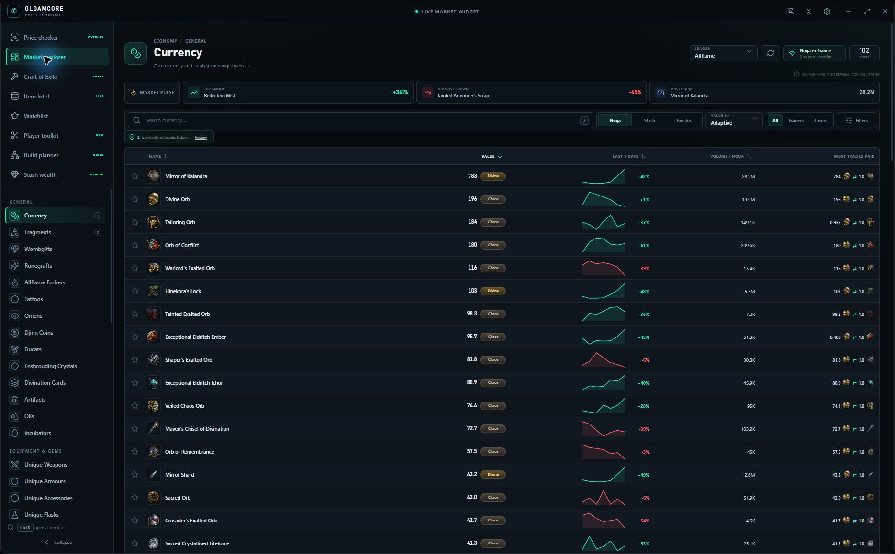
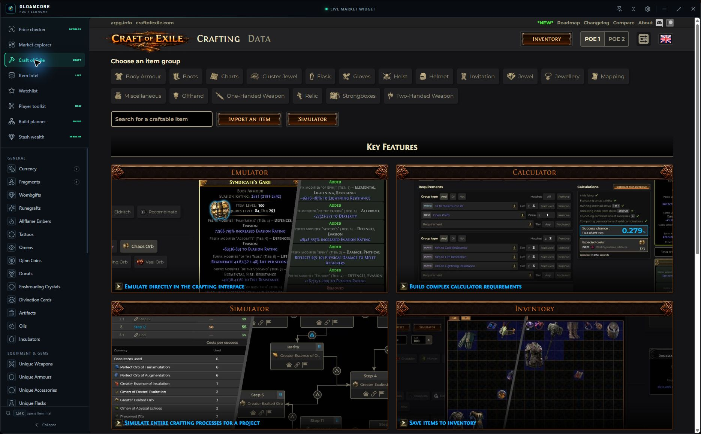

<div align="center">


<h1>GloamCore</h1>

<p><strong>Read the market. Price the item. Plan the build. Craft the project.</strong></p>

A tray-first Path of Exile 1 companion for Windows with one-key local price
checks, current economy context, league navigation, item research, PoB build
planning, Craft of Exile, stash wealth, and practical player tools.

[](https://github.com/seNkoKG/gloamcore/releases/latest)
[](https://github.com/seNkoKG/gloamcore/releases/latest)
[](https://github.com/seNkoKG/gloamcore/releases)
[](https://github.com/seNkoKG/gloamcore/actions/workflows/ci.yml)

[](https://github.com/seNkoKG/gloamcore/releases/latest/download/GloamCore-Setup-x64.exe)

[Website](https://senkokg.github.io/gloamcore/) ·
[Releases](https://github.com/seNkoKG/gloamcore/releases) ·
[Changelog](CHANGELOG.md) ·
[Report a bug](https://github.com/seNkoKG/gloamcore/issues/new?template=bug_report.yml)

</div>



## One app, eight connected workspaces

| Workspace | What it does |
| --- | --- |
| **Price Checker** | Hover an item and press `Ctrl+D` for a compact, roll-aware check. Selected modifiers automatically refresh a bounded public seller-price snapshot, while the complete query remains available on the official Trade website. |
| **Market Explorer** | Browse current poe.ninja markets, trends, liquidity, source age, watch targets, and documented Public Currency Exchange completed-hour evidence from Faustus. |
| **Item Intel** | Search PoE Wiki item and modifier data without leaving the market workflow. |
| **League Command Center** | Follow a source-pinned campaign route, find class-correct gems, and plan the official Atlas with authentic art, exact points, shortest paths, URL sharing, and saved loadouts. |
| **Build Lab** | Import, inspect, edit, and export PoB-compatible builds. Its Upgrade Assistant compares a baseline with a candidate and only calls numeric evidence authoritative after both exact states recalculate through the same verified local PoB engine. |
| **Craft of Exile** | Run the real Craft of Exile interface edge-to-edge in a dedicated, sandboxed desktop browser profile with scoped ads-only filtering. |
| **Stash Wealth** | Keep the real Wealthy Exile website in a different isolated profile that remembers its own sign-in. |
| **Player Toolkit** | Use Map Mod Check, the verified-fact Mapping Journal, PoE Event Log, Cluster Back, regex and filter workbenches, socket tools, audits, and opt-in overlays. |

## League-correct guidance that can update safely

League Navigator uses the exact PoE 1 campaign, quest, area, gem, and vendor
records transformed from a pinned Exile Leveling revision. Its Bandit selector
uses real Path of Exile character artwork and changes the route branch rather
than showing generic checklist text. The optional Library branch is equally
explicit, and acquisition rows are filtered to the selected character class.

The same integrity boundary carries Grinding Gear Games' official Atlas tree
export into Atlas Command Center. Search the exact node stats, inspect authentic
official sprite art, allocate the shortest connected path, traverse official
gateways, refund safely, import/export current official version-6 URLs, and save
or compare named loadouts. Every pack declares a game version,
source commit, byte length, and SHA-256 digest. The app checks the
project-controlled Pages channel at most once every six hours while the League
Command Center is open, validates the entire candidate in memory, activates it in
one cache write, and retains the previous pack for rollback. A scheduled
repository workflow discovers new official Atlas tags and current Navigator
source revisions, rebuilds the packs, runs graph/branch/integrity tests, and
opens a guarded review PR; partial or unreviewed upstream changes are never
published directly to installed clients.

## New in 3.3.1: clean Atlas and coordinated themes

Atlas Command Center now scales official node art with the graph, zooms around
the cursor, focuses search results at a readable level, and uses a full-canvas
floating inspector without changing its exact graph or allocation rules.
League Center and every native workspace can share Gloam Teal, Azurite Blue, or
Ember Gold from Settings. Stash Wealth also removes the site's current Nitro
and Google ad rails on top of its existing isolated ads-only network filter.

## New in 3.3.0: a journal that stores facts, not guesses

Mapping Journal sits beside Map Mod Check and PoE Event Log in Player Toolkit.
On Windows it follows the user-selected PoE 1 `Client.txt` read-only and creates
a session only when the client supplies a current client-safe instance ID, an
internal `MapWorlds…` generation record, and its matching area-entry record.
Portal re-entry is grouped into the same instance, observed time uses the exact
entry-to-next-generation log interval, and interrupted timing is labelled
incomplete.

Deaths are optional and count only exact, case-sensitive system records for the
active character name you enter locally. Search, bounded notes and tags,
summary, deliberate removal, and CSV export are included. Raw log text, chat,
other character names, loot, profit, completion, boss kills, portal counts, and
hidden game state are not persisted or inferred. Exact map artwork comes from
the current league's validated poe.ninja mirror, with the current official
Atlas map sprite as fallback, so presentation follows league refreshes without
controlling the session logic.

## New in 2.9.1: Craft of Exile inside GloamCore

Craft of Exile now fills the desktop workspace directly from the sidebar. This
is the current Craft of Exile website—not a copied interface—and the site keeps
ownership of its settings, inventory, Patreon session, and private responses.



The embedded browser boundary is intentionally narrow:

- a dedicated persistent partition that is not shared with Wealthy Exile;
- Chromium sandbox and context isolation, with no preload, Node, or Electron;
- no filesystem, downloads, game memory, or clipboard reads;
- clipboard writes only for an explicit first-party export action;
- navigation limited to Craft of Exile and Patreon HTTPS origins;
- declared community links open in the system browser; all other cross-origin
  navigation and popups are denied;
- a cached ads-only filter runs only on Craft of Exile pages, turns off during
  Patreon sign-in, and fails open if filter loading is unavailable.

Craft of Exile remains an independent service. Its own privacy policy and
terms apply to the embedded page.

## Price checks that stay inspectable

Hover an item in the English Path of Exile 1 client and press `Ctrl+D`.
GloamCore performs one ordinary copy action, parses the item text locally, and
shows a compact overlay without taking keyboard focus away from the game.

<p align="center">
  <br>
  <em>Copied state, roll-aware filters, aggregate context, and an explicit Trade handoff.</em>
</p>

The checker keeps query-relevant state visible for uniques, rares, magic
items, maps, gems, jewels, weapons, armour, and other supported item families.
For supported Trade queries, changing selected modifiers automatically refreshes
up to five sanitized public seller prices below the editor. Requests use fixed
official Path of Exile search and fetch routes, strict response limits, short
timeouts, and a brief cache; they require no account authorization or POESESSID.
Corruption implicits, influences, links, item level, map state, and supported
roll ranges remain explicit. When the evidence is incomplete, GloamCore marks
it incomplete instead of manufacturing a conversion or confidence signal.

GloamCore does not automate the Trade website's undocumented search, exchange,
or fetch endpoints. Filters are assembled locally; only a deliberate **Trade**
click opens the encoded query on `pathofexile.com/trade`.

> Use Borderless or Windowed Fullscreen for the native overlay. Aggregate
> values and completed-hour evidence are context, not guaranteed sale prices.
> Verify valuable items on the official Trade website.

## Market, builds, and player tools

Market Explorer follows current leagues and supported economy categories with
search, sorting, filters, seven-day movement, liquidity, local watchlists, and
Windows target notifications. Clearly weak, unavailable, or stale evidence
cannot silently become a market mover or alert.

Build Lab accepts PoB XML, codes, supported links, and local files. It preserves
passive specs, masteries, socket and override state, equipment weapon sets,
skills, configurations, cluster and Timeless Jewel state, and notes through
editing and export. Explicit recalculation uses a separately installed,
fingerprint-verified Path of Building Community engine and fails closed when
the engine or build family is unsupported.

<table>
  <tr>
    <td width="50%"></td>
    <td width="50%"></td>
  </tr>
  <tr>
    <td align="center"><strong>Build Lab</strong><br>Import, inspect, edit, compare, calculate, and export.</td>
    <td align="center"><strong>Regex Workbench</strong><br>Explicit WANT/AVOID rules with safe full-tooltip output by default.</td>
  </tr>
</table>

The toolkit also includes a local map-mod verdict overlay, a durable
verified-fact Mapping Journal, a separate read-only in-memory `Client.txt`
event feed, an exact Large Cluster Jewel back-notable finder, Normal/Ruthless
filter validation, socket-colour comparison, economy audits, themes,
checkpoints, cheat sheets, and permissioned opt-in overlays.

## Install on Windows

1. Download [GloamCore Setup for Windows x64](https://github.com/seNkoKG/gloamcore/releases/latest/download/GloamCore-Setup-x64.exe).
2. Open the installer and choose the install location.
3. Launch GloamCore and leave it available from the system tray.
4. Run Path of Exile in Borderless or Windowed Fullscreen, hover an item, and
   press `Ctrl+D`.

The [latest release](https://github.com/seNkoKG/gloamcore/releases/latest)
also publishes a portable executable, updater metadata, release notes, and
SHA-256 checksums. Current Windows binaries are not Authenticode-signed, so
SmartScreen may show an **Unknown publisher** warning. Download only from the
official repository and verify the checksum when needed.

Installed builds can check the stable GitHub release channel. An update may
download in the background when enabled, but installation always waits for an
explicit **Restart & install** action. Portable users replace the executable
manually. See [Update hosting](docs/UPDATE-HOSTING.md) for the exact contract.

## Shortcuts

| Shortcut | Action |
| --- | --- |
| `Ctrl+D` | Copy and locally inspect the item under the cursor |
| `Ctrl+Alt+M` | Check the map under the cursor with local Map Mod rules |
| `Ctrl+Alt+D` | Open the price checker in deliberate locked mode |
| `Ctrl+Shift+E` | Show or hide GloamCore globally |
| `Ctrl+Shift+L` | Toggle click-through mode |
| `Ctrl+Shift+Space` | Open instant market search |
| `/` | Focus market search while GloamCore is active |
| `Ctrl+K` | Open Item Intel and focus its search |

Desktop shortcuts are rebindable in Settings. Conflicting combinations are
rejected without replacing the last working binding.

## Privacy and trust boundaries

- GloamCore does not inspect game memory, inject into Path of Exile, automate
  gameplay, send whispers, or request `POESESSID`.
- It does not request Path of Exile account authorization, account profiles,
  private characters, or native stash responses.
- Preferences, watchlists, normal caches, and saved workspaces stay on the
  local computer.
- PoE Event Log reads the selected `Client.txt` in place. Events remain in
  memory and are not saved or uploaded.
- Craft of Exile and Wealthy Exile run in different persistent browser
  partitions. GloamCore does not read or reuse either site's cookies, sign-in
  tokens, storage, or private responses.
- Remote data and external URLs cross explicit allowlists, size bounds,
  freshness checks, and validation before entering the renderer.
- Economy snapshots older than the documented offline window fail closed, and
  stale fallback data is labelled where supported.

Read [Price checker behavior](docs/PRICE_CHECKER.md),
[Toolkit and Build Lab boundaries](docs/TOOLKIT_AND_PLANNER.md),
[Data provenance](docs/DATA_PROVENANCE.md), and the
[Security policy](SECURITY.md) for the complete model.

## Platforms

The public GitHub release is Windows x64. Android and iOS projects are
development previews built from the same React economy engine; mobile does not
include the Windows global capture overlay or embedded desktop site sessions.
See [Mobile builds](docs/MOBILE.md).

## Development

GloamCore uses React, TypeScript, Vite, and Electron. The desktop process owns
global shortcuts, bounded remote requests, local caches, updates, native
overlays, and a narrow context-isolated preload bridge. Capacitor powers the
mobile development projects.

```powershell
pnpm install --frozen-lockfile
pnpm test
pnpm build
pnpm data:build-game
pnpm electron:dev
```

Create Windows artifacts with `pnpm dist` from the pinned release toolchain.
Read [Contributing](CONTRIBUTING.md) before proposing a change.

## Source and attribution

This repository is **source-available**, not open-source. It declares
`UNLICENSED`; no general permission to copy, modify, or redistribute the source
is granted. Official binaries are provided for end-user installation.

Third-party packages and transformed reference data keep their own licenses
and attribution. See [Third-party notices](THIRD_PARTY_NOTICES.md) and
[Data provenance](docs/DATA_PROVENANCE.md).

---

> **This product is not affiliated with or endorsed by Grinding Gear Games.**

Path of Exile names, artwork, and game data belong to their respective owners.
poe.ninja, Awakened PoE Trade, Path of Building Community, Craft of Exile,
Wealthy Exile, and PoE Wiki are independent projects and do not endorse
GloamCore.
