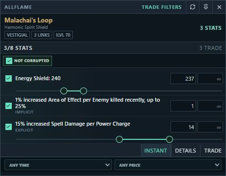
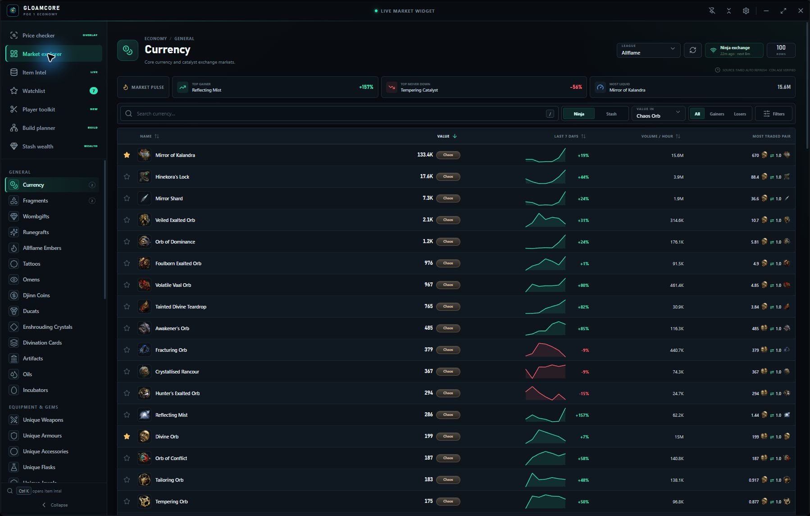
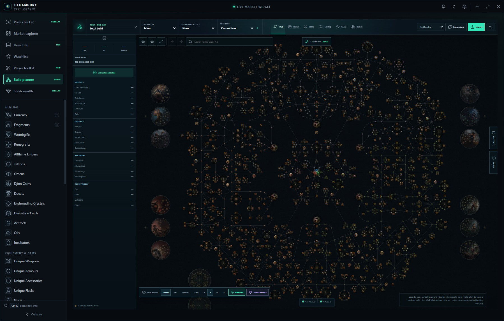
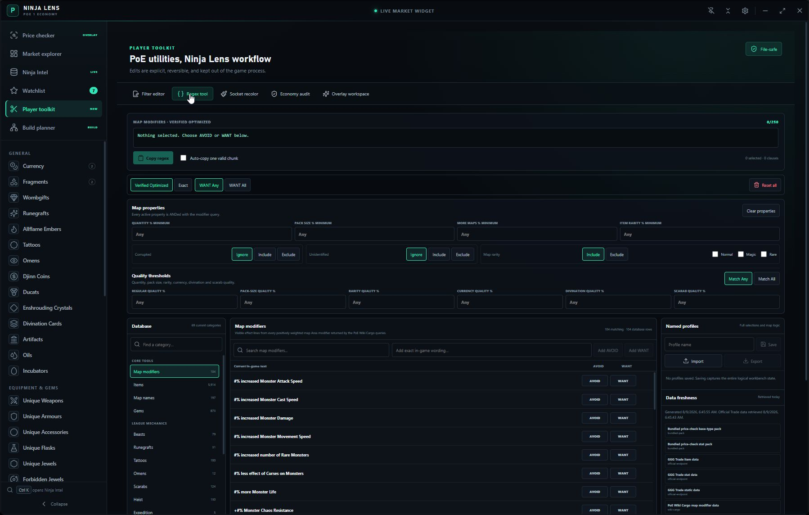

<div align="center">


# Ninja Lens

### Read the market. Price the item. Plan the build.

A focused Path of Exile 1 companion for Windows, bringing one-key item checks,
live economy signals, player utilities, and a local Build Lab into one polished,
tray-first desktop app.

[](https://github.com/seNkoKG/ninja-lens/releases/latest)
[](https://github.com/seNkoKG/ninja-lens/releases/latest)
[](https://github.com/seNkoKG/ninja-lens/releases)

[](https://github.com/seNkoKG/ninja-lens/releases/latest/download/Ninja-Lens-Setup-x64.exe)

[All releases](https://github.com/seNkoKG/ninja-lens/releases) |
[Product website](https://senkokg.github.io/ninja-lens/) |
[Report a bug](https://github.com/seNkoKG/ninja-lens/issues/new?template=bug_report.yml) |
[Read the changelog](CHANGELOG.md)

</div>

## One companion, five focused workflows

### Price check with one shortcut

Hover an item in Path of Exile and press `Ctrl+D`. Ninja Lens performs one item
copy, parses the copied text, and opens a compact overlay over the game. It can
combine a poe.ninja identity estimate with an anonymous snapshot of current
official Trade listings, then hand the complete query to the Trade website.

<p align="center"><br><em>A current modifier plan and anonymized live listings in the compact Ctrl+D surface.</em></p>

Roll-sensitive uniques, rares, magic items, maps, gems, jewels, and other item
families receive contextual state and modifier controls. The local planner is
matched to pinned Awakened PoE Trade data so query-relevant modifiers remain
visible and editable instead of being guessed or reduced to a base-item price.

> Run Path of Exile in **Borderless** or **Windowed Fullscreen** for the native
> overlay. Seller rows are asking prices, not completed sales; always inspect
> the full Trade page before pricing a valuable item.

### Follow the live economy

Explore current poe.ninja markets with league selection, search, filters,
sorting, trend history, liquidity context, and low-confidence handling. Star
items for a local watchlist, set price targets, and receive a Windows
notification when a target is reached.

Ninja Intel adds searchable PoE Wiki Cargo reference data, item artwork,
requirements, modifiers, and safe handoffs to specialist sources. Last-good
market and reference responses remain available when an upstream service has a
temporary outage.

### Work in Build Lab

Import PoB XML, codes, and supported build links into an interactive passive
tree workspace. Build Lab supports tree editing, mastery choices, multiple
specs, items, skills, configuration, notes, saved builds, comparisons,
undo/redo, and PoB export.

For supported PoE 1 character imports and explicit recalculation, Ninja Lens
uses a separately installed, verified Path of Building Community engine. It
fails closed when that engine is missing or does not match the supported
fingerprint; it does not invent calculated DPS.

### Track stash wealth

The Stash Wealth workspace embeds Wealthy Exile in a dedicated, sandboxed
browser view. Wealthy Exile owns its Path of Exile OAuth connection and
renders the stash dashboard unchanged. Ninja Lens does not receive its cookies,
OAuth tokens, or private stash responses. A locally cached ads-only filter list
is applied on Wealthy Exile itself and is disabled on Path of Exile and Steam
sign-in pages. If the filter cannot load, the site opens without filtering.

### Bring practical tools together

The Player Toolkit includes an item-filter editor, a source-tracked regex
workbench, socket-colour comparison, economy audits, pinned reference sheets,
and an opt-in overlay workspace. Macros and plugin permissions start disabled,
and remote plugin pages stay isolated from Node, Electron, the filesystem, and
game memory.

## See Ninja Lens in action

### Market Explorer



*Live market rows, trend signals, exchange context, league controls, and the
watchlist are available from one dark, readable dashboard.*

### Build Lab



*Import a build, inspect the matching installed passive tree, edit allocations,
and return the result to Path of Building.*

### Regex Workbench



*Compose stash and map-search expressions with explicit AVOID/WANT logic,
length-aware output, saved profiles, and visible source freshness.*

## Install on Windows

1. Download [Ninja Lens Setup for Windows x64](https://github.com/seNkoKG/ninja-lens/releases/latest/download/Ninja-Lens-Setup-x64.exe).
2. Open the installer and choose the install location.
3. Launch Ninja Lens, then keep it available from the system tray.
4. In Path of Exile, use Borderless or Windowed Fullscreen and press `Ctrl+D`
   over an item.

A portable build and release checksums are available on the
[latest release page](https://github.com/seNkoKG/ninja-lens/releases/latest).
Current Windows binaries are not Authenticode-signed, so SmartScreen may show
a warning. Verify that the file came from this repository and compare its
checksum before choosing to run it.

## Updates

Version **2.3.4** is the current stable build connected to the GitHub update
channel. Users of an earlier build must install 2.3.4 manually once.

With automatic checks enabled, installed builds check shortly after launch and
then periodically. A newer stable release is downloaded in the background, but
it is never installed silently: Settings shows the status and requires
**Restart & install**. Automatic checks can be disabled, and **Check now** is
always available. Portable users should replace their executable from the
release page.

Maintainer details and the required release assets are documented in
[Update hosting](docs/UPDATE-HOSTING.md).

## Shortcuts

| Shortcut | Action |
| --- | --- |
| `Ctrl+D` | Copy and price-check the item under the cursor in PoE |
| `Ctrl+Shift+E` | Show or hide Ninja Lens globally |
| `Ctrl+Shift+L` | Toggle click-through mode |
| `Ctrl+Shift+Space` | Open instant market search |
| `/` | Focus item search while Ninja Lens is active |
| `Ctrl+K` | Open Ninja Intel and focus its search |

Desktop shortcuts are rebindable in Settings. Conflicting or unavailable
global key combinations are rejected without replacing the working binding.

## Privacy, safety, and upstream limits

- One desktop `Ctrl+D` check generates one ordinary item-copy action. Ninja
  Lens does not inspect game memory, inject into the game, automate gameplay,
  send whispers, or request `POESESSID` and account-session cookies.
- Preferences, watchlists, saved workspaces, and ordinary caches stay on the
  local computer.
- Optional private-character import accepts an official OAuth token with the
  `account:characters` scope. The token is held in memory only, is cleared after
  import, and is never persisted; authenticated character responses are not
  cached. Stash wealth embeds the independent Wealthy Exile service in an
  isolated browser profile; Ninja Lens cannot access that profile from its app
  renderer.
- Compact seller listings use anonymous public Trade website routes without
  credentials. This is an unofficial convenience, not a guaranteed developer
  API; GGG can change, reject, or rate-limit it.
- poe.ninja, PoE Wiki, official Trade, and external handoff services can be
  delayed or unavailable. The app labels stale fallback data where applicable.

Read [Price checker behavior](docs/PRICE_CHECKER.md),
[Toolkit and Build Lab boundaries](docs/TOOLKIT_AND_PLANNER.md), and
[Data provenance](docs/DATA_PROVENANCE.md) for the exact trust boundaries.

## Development

Ninja Lens uses Electron, React, TypeScript, and Vite. The Electron main process
owns global shortcuts, bounded remote requests, disk caching, updates, native
overlay windows, and a narrow isolated preload bridge.

```powershell
pnpm install --frozen-lockfile
pnpm test
pnpm build
pnpm electron:dev
```

Create Windows release artifacts with `pnpm dist` from a configured Windows
release environment. See [Contributing](CONTRIBUTING.md) before proposing a
change and [Security](SECURITY.md) before reporting a vulnerability.

## Source and third-party work

This repository is **source-available**, not open-source. The project declares
`UNLICENSED`; no general license to copy, modify, or redistribute its source is
granted. Official release binaries are provided for end-user installation. Ask
the maintainer before reusing project code.

Third-party packages and transformed reference data retain their own licenses
and attribution. See [Third-party notices](THIRD_PARTY_NOTICES.md) and
[Data provenance](docs/DATA_PROVENANCE.md).

---

> **This product isn't affiliated with or endorsed by Grinding Gear Games in any way.**

Path of Exile names, artwork, and game data belong to their respective owners.
poe.ninja, Awakened PoE Trade, Path of Building Community, and PoE Wiki are
independent projects and do not endorse Ninja Lens.
